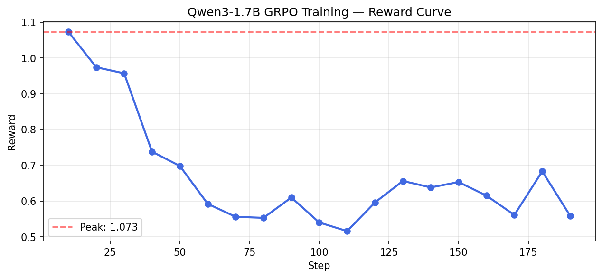
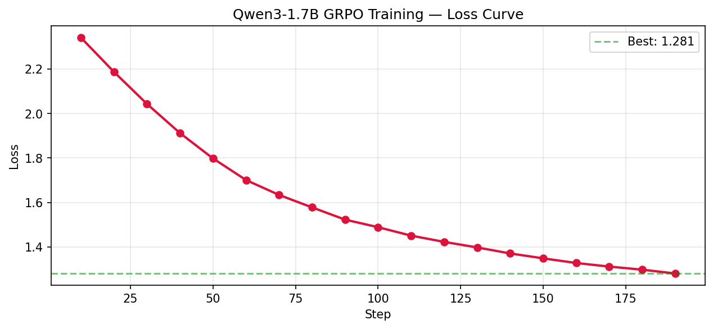

# TITAN Env

**Autonomous satellite fault recovery under radiation stress.**

> Proprietary software. See [LICENSE](./LICENSE).

**New to this repo?** Use **[QUICKSTART.md](./QUICKSTART.md)** for a single page of what to install (Python, PyTorch, Node/npm — **not Ollama**) and the exact commands to run the 3D dashboard (`python server/run.py`).

## What It Does

- Simulates satellite subsystem faults (SEU, thermal, latch-up, memory corruption)
- Provides an LLM-friendly interface for autonomous recovery decisions
- Scores agent performance on realistic fault scenarios (strictly between 0 and 1)

## Why It Matters

Real satellites face radiation-induced faults that require autonomous recovery when ground control is unavailable. TITAN enables training and evaluation of AI agents for these critical safety scenarios.

## How It Works

```
Observation → LLM → Action → Environment → Score
```

## Meta PyTorch OpenEnv Hackathon (submission)

**Required materials (all linked from this README; no large video files in the Hub repo):**

| Requirement | Where |
|-------------|--------|
| **OpenEnv (latest)** | Build on this repo; `openenv validate`. Manifest: [`openenv.yaml`](./openenv.yaml). Wrapper: `titan_env.interface.openenv_wrapper:TITANEnv`. |
| **Training (Unsloth + TRL)** | Colab-style / GPU notebook: [`notebooks/grpo_qwen3_training.ipynb`](./notebooks/grpo_qwen3_training.ipynb) |
| **Training evidence (real run)** | Plots committed in `docs/` (see **Training (evidence)** below). |
| **Runnable HF Space** | **[Hugging Face Space — titan-env](https://huggingface.co/spaces/mugenkyou/titan-env)** |
| **Write-up / video** | **Write-up:** use the [Space README](https://huggingface.co/spaces/mugenkyou/titan-env) as the public mini-blog, or publish a [Hugging Face blog / paper page](https://huggingface.co/blog) and link it here. **Video:** add your public **&lt; 2 min** YouTube URL (replace the placeholder): `https://www.youtube.com/watch?v=YOUR_VIDEO_ID` — do **not** commit video files to the repo. |
| **What judges look for** | [Google Doc (judging guide)](https://docs.google.com/document/d/1Odznuzwtb1ecDOm2t6ToZd4MuMXXfO6vWUGcxbC6mFs/edit?tab=t.0#bookmark=kix.2dz0x0nie3me) |
| **GRPO adapter weights** | Not in git (see [`docs/GRPO_ADAPTER.md`](./docs/GRPO_ADAPTER.md)); download to `grpo_qwen3_local/` or restore `grpo_qwen3_final/` locally. |

**Additional references:**

- **QUICKSTART** (install, PyTorch, 3D dashboard): [QUICKSTART.md](./QUICKSTART.md)
- **Training notebook (Kaggle mirror):** [Kaggle](https://www.kaggle.com/code/jayasimhareddy777/notebook64b334a6c9)

## Quick Start (OpenEnv + inference)

```bash
pip install -e .
openenv validate
python inference.py
```

## TITAN — Satellite Fault Recovery Benchmark

> "A benchmark that forces agents to diagnose before they act — because in space, guessing costs everything."

### The problem

Real satellites face radiation faults during communication blackouts. The agent must recover autonomously without direct fault labels—only symptoms: voltage drops, temperature spikes, memory drift.

### What TITAN does

- **Symptom-only observations** in many eval modes—limited fault exposure in observation
- **DIAGNOSE**-style action path and recovery actions with side effects
- **Fault severity** and **multi-fault** stress in hard tasks
- Scores strictly in `(0, 1)` per task grader

### Training (evidence)

Fine-tuned **Qwen3-1.7B** on the TITAN environment via **GRPO** using **Unsloth** and **Hugging Face TRL** in [`notebooks/grpo_qwen3_training.ipynb`](./notebooks/grpo_qwen3_training.ipynb).

**Reward and loss (from a real run; files committed under `docs/`):**

| Reward (training) | Loss (training) |
|-------------------|-----------------|
|  |  |

### Results (illustrative)

| Policy     | Mean survival (approx.) | Notes              |
|------------|-------------------------|--------------------|
| no_action  | ~12 steps          | baseline           |
| random     | ~18 steps          | baseline           |
| heuristic  | ~31 steps          | no LLM             |
| Qwen3 GRPO | see eval runs         | trained agent      |

## Tasks

- **easy_single_fault_recovery** — Recover onboard memory after radiation-induced corruption before critical data loss. Goal: memory_integrity > 0.9 within 30 steps.
- **medium_thermal_stabilization** — Stabilize CPU and power subsystem temperatures following a thermal fault cascade. Goal: reduce cpu_temperature below 0.70 within 50 steps while keeping average current draw under 0.55.
- **hard_multi_fault_survival** — Survive a compounding multi-fault scenario spanning memory, thermal, and power anomalies. Goal: survive 100 steps without full failure while keeping battery_soc at or above 0.20.

Each task has a corresponding grader; final reported scores are clamped to `(0, 1)`.

### Baseline Scores

Scores below were generated with the built-in no-op fallback policy and seed `42`:

| Task     |      Score | Steps |
| -------- | ---------: | ----: |
| `easy`   | `0.999999` |  `30` |
| `medium` | `0.996000` |  `50` |
| `hard`   | `0.660295` | `120` |

---

## Technical Details

### Environment

The simulator models satellite subsystem health, radiation faults, and
recovery actions. The OpenEnv wrapper (openenv_wrapper) exposes normalized observations.
All continuous telemetry fields are normalized to `[0, 1]`.

#### Observation Space

Power and electrical:

- `voltage`: normalized bus voltage level
- `current_draw`: normalized power demand
- `battery`: normalized battery state of charge

Thermal:

- `cpu_temp`: normalized CPU thermal load
- `power_temp`: normalized power subsystem thermal load

Compute and memory:

- `cpu_load`: normalized processing utilization
- `memory`: normalized memory integrity health

Fault awareness:

- `signal`: derived system health proxy
- `recent_fault_count`: normalized recent fault pressure
- `faults`: active fault label list (for example: `seu`, `thermal`, `memory`)

The underlying core simulator also tracks fault flags (fault_injection) and additional internal
state used for evaluation and grading (reward_v2).

### Action Space

Valid commands accepted by the environment:

| Action             | Description                                             |
| ------------------ | ------------------------------------------------------- |
| `no_action`        | Hold system state and observe progression.              |
| `reset`            | Perform broad recovery reset for unstable states.       |
| `memory_scrub`     | Repair memory integrity after radiation-induced faults. |
| `thermal_throttle` | Reduce heat generation by throttling load.              |
| `load_shedding`    | Drop non-critical load to preserve stability margins.   |
| `power_cycle`      | Reinitialize affected subsystem power state.            |
| `isolate`          | Contain fault spread by isolating a subsystem.          |

## Setup

### Prerequisites

- Python 3.11+ (verify: `python --version`)
- pip or uv package manager
- Docker (optional, for container deployment)
- openenv-core (for validation: `pip install openenv-core`)

### Installation

```bash
# Clone the repository
git clone https://github.com/mugenkyou/titan-environment.git
cd titan-environment

# Create virtual environment (recommended)
python -m venv .venv
source .venv/bin/activate  # On Windows: .venv\Scripts\Activate.ps1

# Install package with dependencies
python -m pip install -e .
```

This installs:

- Core TITAN environment simulator
- OpenEnv wrapper and validation framework
- OpenAI client (for LLM-based inference)
- Testing dependencies (pytest)

### Verify Installation

```bash
# Check OpenEnv compliance
openenv validate
```

## Run Inference

### API Key Configuration

The inference engine supports multiple ways to provide API credentials (tried in order):

1. **local.env file** (recommended for development):

   ```bash
   # Create local.env in the project root
   echo "HF_TOKEN=your-token-here" >> local.env
   # or
   echo "OPENAI_API_KEY=sk-..." >> local.env
   ```

   The file is automatically loaded at runtime and is git-ignored.

2. **Environment variables** (recommended for CI/production):

   ```bash
   export HF_TOKEN="your-token"
   export OPENAI_API_KEY="sk-..."
   ```

3. **Override API endpoint** (optional):
   ```bash
   export API_BASE_URL="https://api.openai.com/v1"
   export MODEL_NAME="gpt-4o-mini"
   ```

The inference script reads `API_BASE_URL`, `MODEL_NAME`, and `HF_TOKEN` first, then falls back to `OPENAI_API_KEY` if `HF_TOKEN` is not set.

### With LLM Agent (OpenAI)

Once credentials are set via any method above, run:

```bash
python inference.py
```

The agent will use your configured API key to call the LLM for policy decisions.

### Fallback Mode (No API Key)

If no API credentials are found, inference gracefully activates a built-in fallback agent:

```bash
python inference.py  # Falls back to no-op policy if credentials are missing
```

This allows reproducible offline testing and validation without external dependencies.

### Output Format

The script logs all task executions in the standardized format:

```text
[START] task=easy env=titan_env.interface.openenv_wrapper:TITANEnv model=fallback-noop
[STEP] step=1 action=no_action reward=0.75 done=false error=null
[STEP] step=2 action=reset reward=0.85 done=false error=null
[END] success=true steps=12 rewards=0.75,0.85
[START] task=medium env=titan_env.interface.openenv_wrapper:TITANEnv model=fallback-noop
...
```

Each task produces three sections:

- `[START]`: Task name, environment, and model name
- `[STEP]`: Per-step results (action, reward, completion status, errors)
- `[END]`: Summary with success flag, total steps, and comma-separated rewards

## Deployment

### Local Docker

Build and run the container locally:

```bash
docker build -t titan-env .
docker run -p 7860:7860 -e PORT=7860 titan-env
```

### HuggingFace Spaces

1. Live Space: https://huggingface.co/spaces/mugenkyou/titan-env
2. Create a new Space at https://huggingface.co/spaces if you need to redeploy or fork it
3. Select "Docker" runtime
4. Push this repository (includes `Dockerfile` and `openenv.yaml`)
5. HuggingFace will auto-build and deploy

### HTTP Endpoints

The server exposes:

- `GET /ping` -> HTTP 200, returns `{"status": "ok"}`
- `POST /reset` -> Resets environment, returns initial observation JSON
- `POST /step` -> Advances environment with payload `{"command": "<action>"}`

Example:

```bash
# Ping
curl -X GET http://localhost:7860/ping

# Reset
curl -X POST http://localhost:7860/reset \
  -H "Content-Type: application/json" \
  -d '{}'

# Step
curl -X POST http://localhost:7860/step \
  -H "Content-Type: application/json" \
  -d '{"command": "no_action"}'
```

## Validation

### Submission Validator

Use the provided validation script to check your submission before upload:

```bash
# On Linux/macOS
bash scripts/validate-submission.sh https://huggingface.co/spaces/mugenkyou/titan-env

# On Windows (PowerShell)
cd scripts
# Run validator manually or use WSL
```

The validator checks:

1. **HF Space Reachability**: Confirms `/reset` endpoint responds with HTTP 200
2. **Docker Build**: Verifies `Dockerfile` compiles without errors
3. **OpenEnv Compliance**: Runs `openenv validate` to ensure manifest is correct

### Manual Validation

```bash
# Check OpenEnv manifest
openenv validate

# Build Docker image
docker build -t titan-env .

# Test HTTP server
curl -X POST http://localhost:7860/reset -H "Content-Type: application/json" -d '{}'
```

## Validation

### Hardening & Submission Validator

Use the provided hardening check script to validate your submission before upload:

```bash
python scripts/hardening_check.py
```

This script checks:

1. Reproducibility: Ensures inference results are consistent
2. Docker Build: Verifies Dockerfile builds successfully
3. API Key Fallback: Confirms fallback agent activates without API keys
4. Log Format: Validates all log lines match [START], [STEP], or [END]
5. OpenEnv Compliance: Runs `openenv validate` and checks manifest
6. (If present) Pytest: Runs tests if a tests/ folder exists

```

## Notes

- The package entrypoint is `titan_env.interface.openenv_wrapper:TITANEnv`.
- The deployment server is `titan_env.server.app`.
- For a full folder breakdown, see [FILE_STRUCTURE.md](./FILE_STRUCTURE.md).
- Additional architecture and system documentation is available in the `docs/` folder.
- System architecture: [docs/system-architecture.md](./docs/system-architecture.md)
- Component diagram: [docs/component-diagram.mmd](./docs/component-diagram.mmd)
```
